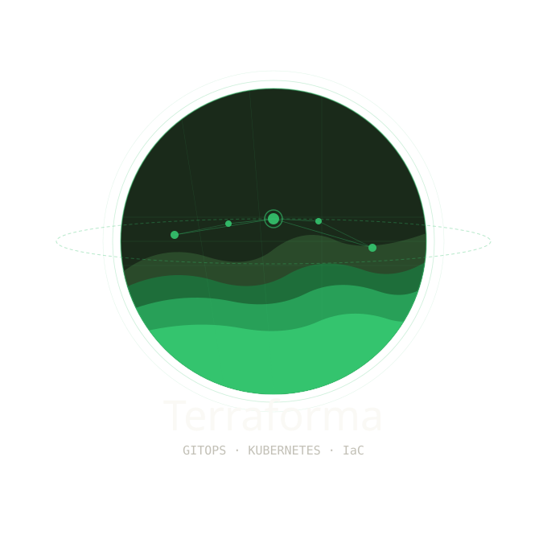

# Terraforma



A local Kubernetes environment using Terraform and Argo CD for `App-of-Apps` style application management.

- Stand up a local Kubernetes cluster with a single command
- Toggle applications on and off via a single `values.yaml`
- Clean everything up when you are done
- Learning, experimenting, testing

---

## Prerequisites

The following tools must be installed and available in your PATH:

| Tool | Version | Install |
|------|---------|---------|
| [Terraform](https://developer.hashicorp.com/terraform/install) | >= 1.6.0 | `brew install terraform` |
| [Docker](https://docs.docker.com/get-docker/) | >= 20.10 | [Docker Desktop](https://www.docker.com/products/docker-desktop/) |
| [kind](https://kind.sigs.k8s.io/docs/user/quick-start/#installation) | >= 0.20.0 | `brew install kind` |
| [kubectl](https://kubernetes.io/docs/tasks/tools/) | >= 1.27.0 | `brew install kubectl` |
| [Helm](https://helm.sh/docs/intro/install/) | >= 3.0.0 | `brew install helm` |

> Docker must be running before executing any Terraform commands.

---

## Quickstart

**1. Clone the repo**
```bash
git clone https://github.com/dcrespo1/terraforma.git
cd terraforma
```

**2. Update the config repo URL**

Edit `root-app/values.yaml` and `bootstrap/root-app.yaml` — replace the `repoURL` with your own fork if you want Argo CD to track your changes:
```yaml
global:
  repoURL: https://github.com/your-username/terraforma
```

**3. Initialize and apply Terraform**
```bash
cd terraform
terraform init
terraform apply
```

This will:
- Spin up a 3-node kind cluster
- Deploy Argo CD via Helm
- Bootstrap the root Argo CD Application pointing at this repo

**4. Set your kubeconfig**
```bash
export KUBECONFIG=$(terraform output -raw kubeconfig_path)
```

**5. Access Argo CD**

Open [http://localhost:8080](http://localhost:8080) in your browser.
```bash
# Get the initial admin password
terraform output -raw argocd_initial_password
```

Login with username `admin` and the password above.

**6. Tear down**
```bash
terraform destroy
```

---

## Toggling Apps

`root-app/values.yaml` controls what gets deployed. Flip `enabled` and push:
```yaml
apps:
  kubePrometheusStack:
    enabled: true    # deployed
  certManager:
    enabled: false   # not deployed
```

Argo CD detects the change and syncs — enabling deploys the app, disabling prunes it and its workloads from the cluster.

---

## Structure
```
bootstrap/
  root-app.yaml          # Applied once by Terraform to bootstrap everything
root-app/
  Chart.yaml
  values.yaml            # Toggle apps on/off here
  templates/
    kube-prometheus-stack.yaml
    ingress-nginx.yaml
    kyverno.yaml
    cert-manager.yaml
    postgresql.yaml
    my-api.yaml
apps/
  my-api/                # Raw manifests for in-repo apps
    deployment.yaml
    service.yaml
  kyverno-policies/      # Kyverno ClusterPolicy manifests
    require-resource-limits.yaml
    disallow-latest-tag.yaml
terraform/
  main.tf
  variables.tf
  outputs.tf
  versions.tf
```

---

## Adding a New App

1. Add a toggle to `root-app/values.yaml`:
```yaml
   apps:
     myNewApp:
       enabled: true
       namespace: my-new-app
```
2. Add a template to `root-app/templates/my-new-app.yaml`
3. Push to `main`, open a PR to `deploy` — Argo CD picks it up on merge.